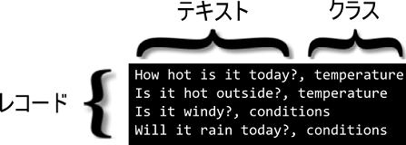

---

copyright:
  years: 2015, 2017
lastupdated: "2017-04-20"

---

{:new_window: target="_blank"}
{:shortdesc: .shortdesc}

# 独自データの使用
[開始](/doc/natural-language-classifier/getting-started.html)の例のデータを使用して {{site.data.keyword.nlclassifierfull}} の作成、トレーニング、および照会を行ったら、独自データで動作する分類子を作成することができます。このトレーニング・データを作成して指定します。
{:shortdesc}

## トレーニング・データの構造
{{site.data.keyword.nlclassifiershort}} のトレーニングのためのデータをコンマ区切り値 (CSV) フォーマットで提供できます。

CSV フォーマットでは、ファイル内の行は 1 つのサンプル・レコードを表します。各レコードには複数の列があります。最初の列は、分類する典型的なテキストです。追加の列は、そのテキストに適用されるクラスです。以下のイメージは、4 つのレコードがある CSV ファイルを示しています。このサンプル内の各レコードには、テキスト入力と 1 つのクラスが含まれ、コンマで区切られています。

この例は小規模なサンプルです。通常のトレーニング・データには、これより多くのレコードが含まれています。

<a target="_blank" href="https://watson-developer-cloud.github.io/doc-tutorial-downloads/natural-language-classifier/weather_data_train.csv" download="weather_data_train.csv">weather_data_train.csv</a> ファイルをダウンロードして、サンプルのトレーニング・データ・ファイルを確認します。

### 追加のメタデータ

分類子を作成する要求には、テキストとクラスに加えて、追加情報が含まれています。メタデータは、データの言語を指定します。分類子を識別するために役立つ名前を含めることもできます。

### CSV トレーニング・データ・ファイル・フォーマット

CSV トレーニング・データが以下のフォーマット要件に準拠していることを確認してください。

- データは UTF-8 エンコードでなければなりません。
- テキスト値と各クラス値をコンマ区切り文字で区切ってください。各レコード (行) は行末文字で終了します。行末文字は、行の終わりを示す 1 つの特殊文字または文字のシーケンスです。
- 各レコードには、1 つのテキスト値と少なくとも 1 つのクラス値が必要です。
- クラス値にタブや行末文字を含めることはできません。
- 特別な処理を行わない限り、テキスト値にタブや改行を含めることはできません。タブまたは改行を保持するには、`\t` を指定してタブをエスケープし、`\r`、`\n`、または `\r\n` を指定して改行をエスケープします。

	例えば、`Example text\twith a tab` は有効ですが、`Example text    with a tab` は無効です。
- トレーニング・データに以下の文字が含まれている場合は、必ずテキスト値またはクラス値を二重引用符で囲んでください。
	- コンマ: `"Example text, with comma"`。
	- 二重引用符。また、引用符は二重引用符でエスケープする必要があります。`"Example text with ""quotation"""`。

## サイズ制限
トレーニング・データには、最小制限と最大制限の両方があります。

-   トレーニング・データのレコード (行) 数は、5 個から 15,000 個まででなければなりません。
-   テキスト値の最大合計長は 1024 文字です。

## 言語
デフォルトの言語は英語ですが、分類子の作成時にはトレーニング・データの言語を指定することができます。トレーニング・データの言語は、分類するテキストの言語と一致する必要があります。詳細については、[API リファレンス ](http://www.ibm.com/watson/developercloud/natural-language-classifier/api/v1/){:new_window} を参照してください。

分類子では、英語 (en)、アラビア語 (ar)、フランス語 (fr)、ドイツ語 (de)、日本語 (ja)、イタリア語 (it)、ブラジル・ポルトガル語 (pt)、およびスペイン語 (es) がサポートされます。

## 適切なトレーニングのガイドライン
以下のガイドラインは、API によって強制されるものではありません。ただし、トレーニング・データがこれらに準拠していると、分類子のパフォーマンスが向上する傾向があります。

- 入力テキストの長さは、60 語未満に制限してください。
- クラスの数は、数百個に制限してください。サービスの将来のバージョンでは、より多くの数のクラスのサポートが導入される可能性があります。
- 各テキスト・レコードにクラスが 1 つしかない場合、少なくとも 5 個から 10 個のレコードで各クラスをマッチングさせるようにしてください。この数により、そのクラスで十分なトレーニングが行われるようになります。
- 複数のクラスのニーズを評価します。一般的に、複数のクラスが推奨される理由は以下の 2 つです。
	- テキストがあいまいである場合は、1 つのクラスを特定することは常に明確であるとは限りません。
	- 複数の専門家がテキストをそれぞれ異なる方法で解釈する場合は、複数のクラスがそれらの解釈をサポートします。

	ただし、トレーニング・データ内の多くのテキストに複数のクラスが含まれている場合、またはいくつかのテキストに 3 つより多くのクラスがある場合は、クラスの絞り込みが必要になることがあります。例えば、クラスが階層であるかどうかを確認してください。階層である場合は、リーフ・ノードをクラスとして含めてください。
-  トレーニング・データの一部である (`back-to-back` や `part-time job`) 場合は、行末ハイフン付けした標準の用語を含めます。

	ただし、トレーニング・データの言語にない新しい用語を作成する場合に、隣接する用語をつなげないでください。例えば、`dish-ran-away` や `with_the_spoon` を定義するのではなく、適切なクラスを使用して、関連する句を別個の用語 (`dish ran away` や `with the spoon`) として定義します。

## トレーニング・データの構成
機械学習とは、データのセットからいくつかの特性を学習した後で、それらの特性を新規データに適用するプロセスのことです。{{site.data.keyword.nlclassifiershort}} サービスは以下のプロセスに従います。このサービスは、事前定義クラスをサンプル・テキストに関連付けるようにトレーニングされた後で、それらのクラスを新規の入力に適用します。

そのため、トレーニングされた分類子の精度は、トレーニング・データの品質によって決定します。データ内の各テキスト値は、その分類子で予測すると予期されるテキストの種類を表している必要があります。返されると予期される各クラスも、トレーニング・データ内に存在する必要があります。また、各テキストに関連付けるクラスが正しい必要があります。

例えば、トレーニング・データのテキストが質問の場合、ユーザーが尋ねる典型的な質問を使用します。これらのテキストは実際のユーザー・データから収集することも、この分野の専門家にテキストを作成してもらうこともできます。

分類子のすべてのプロセスおよび結果はこのデータから導出されるため、典型的かつ正確なデータを使用することが重要です。また、トレーニング・データ内に含めるレコードが多くなるほど、分類子が一致を検出する可能性も高くなります。
