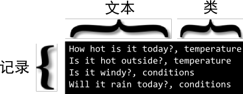

---

copyright:
  years: 2015, 2017
lastupdated: "2017-04-20"

---

{:new_window: target="_blank"}
{:shortdesc: .shortdesc}

# 使用自己的数据
使用[入门](/doc/natural-language-classifier/getting-started.html)示例中的数据创建、培训和查询 {{site.data.keyword.nlclassifierfull}} 后，您会希望创建使用自己数据的分类器。您可组合并提供这些培训数据。
{:shortdesc}

## 培训数据的结构
可以提供逗号分隔值 (CSV) 格式的数据来培训 {{site.data.keyword.nlclassifiershort}}。

CSV 格式的文件中，一行表示一个示例记录。每个记录有两列或更多列。第一列是要分类的代表性文本。其他列是应用于该文本的类。下图显示了具有四个记录的 CSV 文件。此样本中的每个记录都包含文本输入和一个类（以逗号分隔）：

此示例是很小的样本。正常培训数据包含的记录要多得多。

下载 <a target="_blank" href="https://watson-developer-cloud.github.io/doc-tutorial-downloads/natural-language-classifier/weather_data_train.csv" download="weather_data_train.csv">weather_data_train.csv</a> 文件可查看样本培训数据文件。

### 其他元数据

除了文本和类，创建分类器的请求还包含其他信息。元数据用于识别数据的语言，此外还可包含名称来帮助标识分类器。

### CSV 培训数据文件格式

确保 CSV 培训数据遵循以下格式需求：

- 数据必须采用 UTF-8 编码。
- 使用逗号定界符来分隔文本值和每个类值。每个记录（行）以行结束字符结尾；行结束字符是指示行结束的一个特殊字符或字符序列。
- 每个记录必须具有一个文本值以及至少一个类值。
- 类值不能包含制表符或行结束字符。
- 文本值不能包含未经特殊处理的制表符或换行符。要保留制表符或换行符，请使用 `\t` 对制表符转义，使用 `\r`、`\n` 或 `\r\n` 对换行符转义。

	例如，`Example text\twith a tab` 是有效的，但 `Example text    with a tab` 是无效的。
- 在培训数据中，文本或类值包含以下字符时，务必用双引号将其括起：
	- 逗号：`"Example text, with comma"`。
	- 双引号。此外，引号必须使用双引号进行转义：`"Example text with ""quotation"""`。

## 大小限制
培训数据有最小和最大限制：

-   培训数据必须至少有五个记录（行），但不超过 15,000 个记录。
-   文本值的最大总长度为 1024 个字符。

## 语言
虽然缺省语言为英语，但您可以在创建分类器时，指定培训数据的语言。培训数据的语言必须与您打算分类的文本的语言相匹配。有关详细信息，请参阅 [API 参考 ](http://www.ibm.com/watson/developercloud/natural-language-classifier/api/v1/){:new_window}。

分类器支持英语 (en)、阿拉伯语 (ar)、法语 (fr)、德语 (de)、日语 (ja)、意大利语 (it)、巴西葡萄牙语 (pt) 和西班牙语 (es)。

## 良好培训准则
API 并未强制实施以下准则。但是，如果培训数据遵循这些准则，分类器的性能可能会更好：

- 将输入文本的长度限制为少于 60 个词。
- 将类的数量限制在几百个类以内。该服务的更高版本可能会支持更多数量的类。
- 确保在每个文本记录只有一个类时，每个类至少与 5 - 10 个记录相匹配。此数量的记录可提供对该类的足够培训。
- 评估是否需要多个类。需要多个类的常见原因有两个：
	- 文本含义不明确，不一定能明确识别单个类。
	- 不同专家以不同方式解释文本时，多个类可支持这些解释。

	但是，如果培训数据中有许多文本包含多个类，或者某些文本有三个以上的类，那么可能需要优化这些类。例如，复查这些类是否为分层的。如果是分层的，请将叶节点包含为类。
-  包含培训数据中含有的以连字符连接的标准术语（`back-to-back` 或 ` part-time job`）。

	但是，不要连接相邻词语来创建培训数据的语言中找不到的新术语。例如，不要定义 `dish-ran-away` 或 `with_the_spoon`，而是使用相应类将相关短语定义为单独的词语（`dish ran away` 和 `with the spoon`）。

## 构造培训数据
机器学习描述了从一组数据中学习某些属性，然后将这些属性应用于新数据的过程。{{site.data.keyword.nlclassifiershort}} 服务遵循此过程。它经过培训，可将预定义类连接到示例文本，然后将这些类应用于新输入。

所以，培训后的分类器的性能不超出培训数据。数据中的每个文本值必须表示您期望分类器预测的文本类型。此外，您期望返回的每个类也必须位于培训数据中，并且与每个文本关联的类必须正确。

例如，如果培训数据中的文本是提问，请使用在用户提问中具有代表性和典型性的提问。您可从实际用户数据中收集这些文本，也可让您的领域的专家来创建这些文本。

数据的这一代表性和准确性十分重要，因为它将推动分类器中的所有流程以及结果。此外，在培训数据中包含的记录越多，分类器能找到匹配项的机会也越多。
