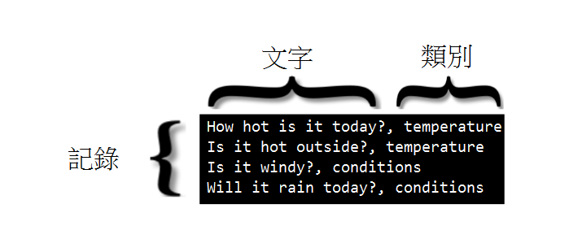

---

copyright:
  years: 2015, 2017
lastupdated: "2017-04-20"

---

{:new_window: target="_blank"}
{:shortdesc: .shortdesc}

# 使用自己的資料
使用[開始使用](/doc/natural-language-classifier/getting-started.html)範例中的資料來建立、訓練及查詢 {{site.data.keyword.nlclassifierfull}} 之後，將會想要建立可使用您專屬資料的分類器。您可以組合及提供這個訓練資料。
{:shortdesc}

## 訓練資料結構
您可以提供逗點區隔值 (CSV) 格式的資料來訓練 {{site.data.keyword.nlclassifiershort}}。

在 CSV 格式中，檔案中的一列代表一筆範例記錄。每一筆記錄都有兩個以上的直欄。第一個直欄是要分類的代表文字。其他直欄是套用至該文字的類別。下列影像顯示包含四筆記錄的 CSV 檔案。在此範例中，每一筆記錄都會包括以逗點區隔的文字輸入及一個類別：

此範例是小型範例。適當的訓練資料包括許多其他記錄。

下載 <a target="_blank" href="https://watson-developer-cloud.github.io/doc-tutorial-downloads/natural-language-classifier/weather_data_train.csv" download="weather_data_train.csv">weather_data_train.csv</a> 檔案，以查看範例訓練資料檔案。

### 其他 meta 資料

除了文字及類別之外，建立分類器的要求還會包括其他資訊。meta 資料可識別資料語言，而您也可以包括可協助您識別分類器的名稱。

### CSV 訓練資料檔案格式

請確定 CSV 訓練資料遵循下列格式需求：

- 資料必須是 UTF-8 編碼。
- 以逗點定界字元區隔文字值與每一個類別值。每一筆記錄（列）都會以行尾字元終止，而行尾字元是特殊字元或指出行尾的一系列字元。
- 每一筆記錄都必須具有一個文字值及至少一個類別值。
- 類別值不能包括定位點或行尾字元。
- 文字值不能包含未經特殊處理的定位點或換行。若要保留定位點或換行，請使用 `\t` 跳出定位點，並使用 `\r`、`\n` 或 `\r\n` 跳出換行。

	例如，`Example text\twith a tab` 有效，但 `Example text    with a tab` 無效。
- 訓練資料包括下列字元時，一律使用雙引號括住訓練資料中的文字或類別值：
	- 逗點：`"Example text, with comma"`。
	- 雙引號。此外，也必須使用雙引號跳出引號：`"Example text with ""quotation"""`。

## 大小限制
訓練資料同時具有最小及最大限制：

-   訓練資料必須有至少五筆記錄（列），但不得超過 15,000 筆記錄。
-   文字值的總長度上限是 1024 個字元。

## 語言
雖然預設語言是英文，但是您可以在建立分類器時指定訓練資料語言。訓練資料語言必須符合您要分類之文字的語言。如需詳細資料，請參閱 [API 參考資料 ](http://www.ibm.com/watson/developercloud/natural-language-classifier/api/v1/){:new_window}。

分類器支援英文 (en)、阿拉伯文 (ar)、法文 (fr)、德文 (de)、日文 (ja)、義大利文 (it)、巴西葡萄牙文 (pt) 及西班牙文 (es)。

## 良好訓練的準則
下列準則不是透過 API 強制執行。不過，訓練資料遵循它們時，分類器的執行效能會較佳：

- 將輸入文字長度限制成少於 60 個單字。
- 將類別數目限制為數百個類別。服務的更新版本可能會支援較大數量的類別。
- 每一個文字記錄只有一個類別時，請確定每一個類別都符合至少 5 - 10 筆記錄。這個數目可提供該類別的足夠訓練。
- 評估多個類別的需求。兩個常見的原因會驅動多個類別：
	- 文字模糊不清時，不一定可以清楚地識別單一類別。
	- 專家以不同的方式來解譯文字時，有多個類別支援這些解釋。

	不過，如果訓練資料中的許多文字都包括多個類別，或者部分文字有三個以上的類別，您可能需要修正類別。例如，檢閱類別是否為階層式。如果它們是階層式，請將葉節點包括為類別。
-  如果標準加連號的術語是訓練資料的一部分，請包括標準加連號的術語（`back-to-back` 或 `part-time job`）。

	不過，請不要連接相鄰單字，來建立訓練資料語言中找不到的新術語。例如，將相關詞組定義為具有適當類別的個別單字（`dish ran away` 及 `with the spoon`），而不要定義 `dish-ran-away` 或 `with_the_spoon`。

## 建構訓練資料
機器學習可說明學習來自一組資料的部分內容後將內容套用至新資料的程序。{{site.data.keyword.nlclassifiershort}} 服務遵循此程序。它經過訓練，以將預先定義的類別連接至範例文字，然後將那些類別套用至新輸入。

因此，受過訓練的分類器就只是訓練資料。資料中的每一個文字值都必須代表您預期分類器預測的文字類型。您預期傳回的每個類別也必須位在訓練資料中，而與每一個文字相關聯的類別都必須正確。

例如，訓練資料中的文字發生問題時，請使用具代表性且一般是使用者所問問題的問題。您可以從實際使用者資料收集這些文字，也可以讓您領域中的專家建立文字。

資料的這個代表性且精確的本質十分重要，因為它會驅動分類器的所有程序以及分類器的結果。此外，您包括在訓練資料中的記錄筆數越多，分類器必須符合相符項目的機會就越大。
