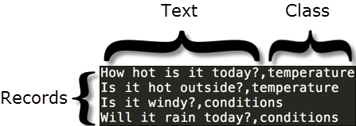

---

copyright:
  years: 2015, 2017
lastupdated: "2017-07-17"

---

{:new_window: target="_blank"}
{:shortdesc: .shortdesc}

# Using your own data
After you create, train, and query an {{site.data.keyword.nlclassifierfull}} with the data in the [Getting started](/doc/natural-language-classifier/getting-started.html) example, you will want to create a classifier that works with your own data. You assemble and provide this training data.
{:shortdesc}

## Structure of training data
You can provide the data to train the {{site.data.keyword.nlclassifiershort}} in comma-separated value (CSV) format.

In the CSV format, a row in the file represents an example record. Each record has two or more columns. The first column is the representative text to classify. The additional columns are classes that apply to that text. The following image shows a CSV file that has four records. Each record in this sample includes the text input and one class, which are separated by a comma:

This example is a small sample. Proper training data includes many more records.

Download the <a target="_blank" href="https://watson-developer-cloud.github.io/doc-tutorial-downloads/natural-language-classifier/weather_data_train.csv" download="weather_data_train.csv">weather_data_train.csv</a> file to see a sample training data file.

### Additional metadata

In addition to the text and classes, the request to create a classifier includes additional information. The metadata identifies the language of the data, and you can also include a name to help you identify the classifier.

### CSV training data file format

Make sure that your CSV training data adheres to the following format requirements:

- The data must be UTF-8 encoded.
- Separate text values and each class value by a comma delimiter. Each record (row) is terminated by an end-of-line character, which is a special character or sequence of characters that indicate the end of a line.
- Each record must have one text value and at least one class value.
- Class values cannot include tabs or end-of-line characters.
- Text values cannot contain tabs or new lines without special handling. To preserve tabs or new lines, escape a tab with `\t`, and escape new lines with `\r`, `\n` or `\r\n`.

	For example, `Example text\twith a tab` is valid, but `Example text    with a tab` is not valid.
- Always enclose text or class values with double quotation marks in the training data when it includes the following characters:
	- Commas: `"Example text, with comma"`.
	- Double quotation marks. In addition, quotation marks must be escaped with double quotation marks: `"Example text with ""quotation"""`.

## Size limitations
There are both minimum and maximum limits to the training data:

-   The training data must have at least five records (rows) and no more than 15,000 records.
-   The maximum total length of a text value is 1024 characters.

## Languages
Although the default language is English, you can specify the language of the training data when you create the classifier. The language of the training data must match the language of the text that you intend to classify. For details, see the [API reference ](http://www.ibm.com/watson/developercloud/natural-language-classifier/api/v1/){:new_window}.

The classifier supports English (en), Arabic (ar), French (fr), German (de), Italian (it), Japanese (ja), Korean (ko), Portuguese (Brazilian) (pt), and Spanish (es).

## Guidelines for good training
The following guidelines are not enforced by the API. However, the classifier tends to perform better when the training data adheres to them:

- Limit the length of input text to fewer than 60 words.
- Limit the number of classes to several hundred classes. Support for larger numbers of classes might be included in later versions of the service.
- Make sure that each class is matched with at least 5 - 10 records when each text record has only one class. This number provides enough training on that class.
- Evaluate the need for multiple classes. Two common reasons drive multiple classes:
	- When the text is vague, identifying a single class is not always clear.
	- When experts interpret the text in different ways, multiple classes support those interpretations.

	However, if many texts in your training data include multiple classes, or if some texts have more than three classes, you might need to refine the classes. For example, review whether the classes are hierarchical. If they are hierarchical, include the leaf node as the class.
-  Include standard hyphenated terms when they are part of the training data (`back-to-back` or ` part-time job`).

	However, don't connect adjacent words to create new terms not found in the language of the training data. For example, instead of defining `dish-ran-away` or `with_the_spoon`, define the relevant phrases as separate words (`dish ran away` and `with the spoon`) with the appropriate class.

## Constructing training data
Machine learning describes a process of learning some properties from a set of data and then applying the properties to new data. The {{site.data.keyword.nlclassifiershort}} service follows this process. It is trained to connect predefined classes to example texts and then applies those classes to new inputs.

So, the trained classifier is only as good as the training data. Each text value in the data must represent the kinds of texts that you expect the classifier to predict. Every class that you expect to return must also be in the training data, and the classes that you associate with each text must be correct.

For example, when the texts in your training data are questions, use questions that are representative and typical of the questions that your users ask. You might collect these texts from actual user data, or you might have people who are experts in your field create the texts.

This representative and accurate nature of the data is important because it drives all the processes of and results from the classifier. In addition, the more records that you include in the training data, the more opportunity the classifier has to find a match.
